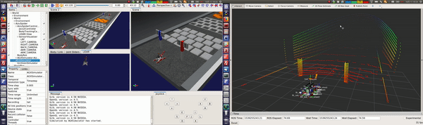

# ChoreonoidのインストールとROSとの連携について
Tipsを詰め込んでゆくぜぃ

---

# 環境セットアップ
## 0. 参考にすべきページ
基本的には，下記リンクに書いてある手順通りに進めれば良い．  
が，我々はOpenRTMは使わないし，Python関係も使わないので，そういったところを最適化した手順を記しておく．  

- Choreonoidの環境セットアップ
http://choreonoid.org/ja/manuals/latest/wrs2018/setup.html  
- ROSブリッジとの環境セットアップ
http://choreonoid.org/ja/manuals/latest/wrs2018/teleoperation-ros.html


## 1. AGX Dynamicsのインストール
AGX Dynamicsは下記リンクよりダウンロード  
https://www.algoryx.se/download/?id=1347  

2018/10/12時点では，`agx-setup-2.24.0.1-x64-ubuntu_16.04-double.deb`がダウンロードできる．

```bash
# インストール
cd <path deb package is downloaded> 
sudo dpkg -i agx-setup-2.24.0.1-x64-ubuntu_16.04-double.deb    // パッケージインストール

# AGX実行ライセンスファイルの配置
sudo cp -i agx.lic  /opt/Algoryx/AgX-2.24.0.1                  // agx.licは配られたやつ

# 環境変数の設定
cd ~                                                               // ホームディレクトリに移動
echo "source /opt/Algoryx/AgX-2.19.1.2/setup_env.bash" >> .bashrc
env | grep -i agx                                                  // AGX_DIRやAGX_BINARY_DIRなどが表示されること
```

**運営からもらったUSBがドングルになっており，挿してないとライセンスが有効にならない**

## 2. Choreonoid と choreonoid_ros_pkg のインストール
ここが割とだるい．頑張ろう．  
ROSのインストールとかはわかりきっとるものとしてスタートする．  
後は下のとおりに頑張る．それで動くはず

```bash
$ mkdir -p <catkin_ws>/src
$ cd <catkin_ws>/src
$ git clone -b devel git@github.com:WRS-TNK/choreonoid.git
$ git clone -b devel git@github.com:WRS-TNK/choreonoid_ros_pkg.git
$ git clone -b devel git@github.com:WRS-TNK/wrs_tnk_robot.git
$ source choreonoid/misc/script/install-requisites-ubuntu-16.04.sh
$ cd <catkin_ws>
$ rosdep install -i -y -r --from-paths src
$ catkin config --cmake-args -DBUILD_AGX_DYNAMICS_PLUGIN=ON -DBUILD_AGX_DYNAMICS_PLUGIN=ON -DBUILD_AGX_BODYEXTENSION_PLUGIN=ON -DBUILD_SCENE_EFFECTS_PLUGIN=ON -DBUILD_MULTICOPTER_PLUGIN=ON -DBUILD_MULTICOPTER_SAMPLES=ON -DENABLE_PYTHON=OFF -DUSE_PYBIND11=OFF -DBUILD_PYTHON_PLUGIN=OFF -DBUILD_PYTHON_SIM_SCRIPT_PLUGIN=OFF -DUSE_PYTHON3=OFF 
$ catkin build choreonoid
$ catkin build
```

---

# 実行方法
### 1. roscore 起動
```bash
$ roscore
```

### 2. choreonoid 起動（T1 AizuSpiderSA）
```bash
$ cd <catkin_ws>
$ ./devel/bin/choreonoid src/choreonoid/sample/WRS2018/T1-AizuSpiderSA.cnoid
```
起動したら，左上のスタートボタンを押下．  
うまく言ってれば，トピックにいろいろ情報が流れるよ．

### 3. Descriptionの起動（後々要らなくなるかも）
```bash
$ cd <catkin_ws>
$ catkin source
$ roslaunch aizu_spider_tnk_description display.launch
```

うまくいったら下記みたいに動かせるはず．  



---

### プロジェクトファイル四方山話
- yaml形式なので```.body```, ```.cnoid```をyaml形式で読み込むようエディタ設定をしておく．
- 現在公式が使っているpythonプラグイン(```T1-**.py```など)は自由度がかなり低いので使わないほうがいいかも
- 適当なプロジェクトファイルを開いてchoreonoid上で編集→別名で保存が割と安心
- 中岡先生謹製のRosPluginも未実装が多く現状使えない

---

### 困ったらここを見ろ！

- choreonoid掲示板
https://discourse.choreonoid.org/  
Githubアカウントでアカウント作れるんで，よろしくお願いします．

- choreonoid公式マニュアル
http://choreonoid.org/ja/manuals/latest/index.html  
書いてないことも多いけど大体のことは書いてある．多分．

---

### 困ったらこれをしろリスト
下記に過去に困っていたことに関するメモを残しておく．  
これらは解決済みなので，実行する必要はない．

#### 1. プラグイン作れない問題（解決済み）
catkin_wsのリセット&choreonoid再インスト
というのも，プラグインの実体が自動生成されなかったり正しい場所に生成されなくなるケースが多々ある．
詳しい原因は不明だがcmakeの動作が安定しないせいだと思われる．
  - 今の所動作不良を起こしたプラグイン一覧
  pythonプラグイン
  AGXdynamicsプラグイン
  RosBodyプラグイン


#### プラグイン読み込めない問題（解決済み）
ロボットの操作は```AISTSimulator```もしくは`AGXSimulator`アイテムを追加すればよい．
アイテムがおいてある階層が重要になっており，これらのシミュレーションアイテムはモデルアイテムと同階層に置くこと．
以下にシミュレーション中のスクショを置いとくので参考までに(AGX使用)
ペインとかいろいろイジってあるのでプロジェクトファイル参照．(`sample/WRS2018/AizuSpiderSA.cnoid`)


#### choreonoid_ros_pkgについて（解決済み）
現在(2018/09/19)，BodyRosプラグインが起動時に読み込まれないので起動した後手動で読み込む．
- `ファイル`→`プラグインの読み込み`→`プラグインファイル選択(/devel/lib/choreonoid-1.7/libCnoidRosBodyPlugin.so)`

その後`WorldRos`アイテムと`BodyRos`アイテムを追加．
- `ファイル`→`新規`→`WorldRos`or`BodyRos`

この時，追加する階層に注意する．上記スクショ参照

- roscore立ち上げてからシミュレーションを実行

すると，センサトピック諸々が吐かれてくる．
