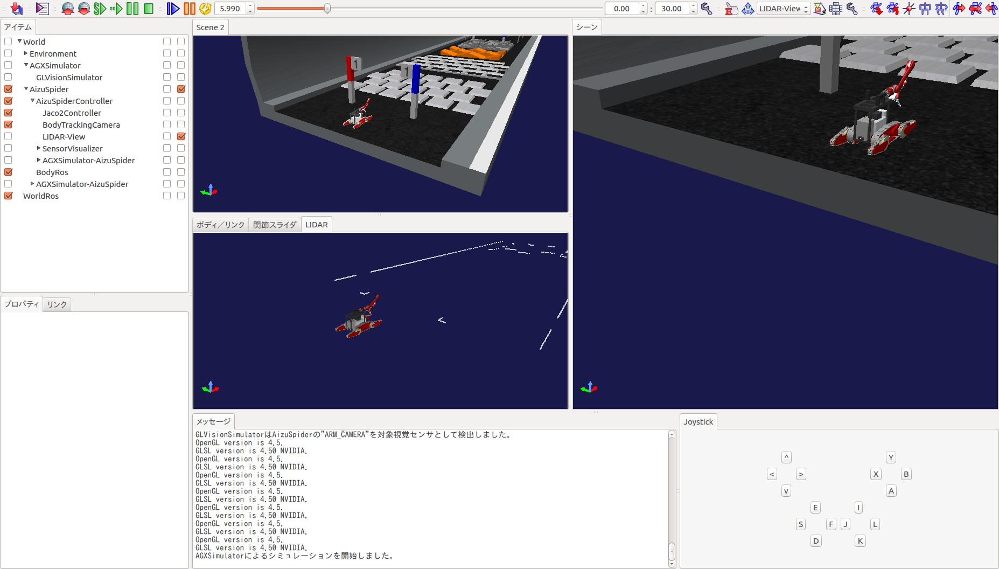

# Choreonoid の使い方等について

### 1. 困ったらここを見ろ！

- choreonoid掲示板
https://discourse.choreonoid.org/  
Githubアカウントでアカウント作れるんで，よろしくお願いします．

- choreonoid公式マニュアル
http://choreonoid.org/ja/manuals/latest/index.html
書いてないことも多いけど大体のことは書いてある．多分．

### 2. ChoreonoidとChoreonoid_ROS_Bridgeのソースコードのありか
- Choreonoid : https://github.com/WRS_TNK/choreonoid
- choreonoid_ros_bridge : https://github.com/WRS_TNK/choreonoid_ros_pkg

両方共catkin_ws内において`catkin build`．普通にROS使う感覚でビルドして使う

### 3. AGXDynamicsライセンス
基本的なインストールは公式マニュアルの通り．
運営からもらったUSBがドングルになっており，挿してないとライセンスが有効にならない

### 4. シミュレーションアイテムについて
ロボットの操作は```AISTSimulator```もしくは`AGXSimulator`アイテムを追加すればよい．
アイテムがおいてある階層が重要になっており，これらのシミュレーションアイテムはモデルアイテムと同階層に置くこと．
以下にシミュレーション中のスクショを置いとくので参考までに(AGX使用)
ペインとかいろいろイジってあるのでプロジェクトファイル参照．(`sample/WRS2018/AizuSpiderSA.cnoid`)


### 5. choreonoid_ros_pkgについて
現在(2018/09/19)，BodyRosプラグインが起動時に読み込まれないので起動した後手動で読み込む．
- `ファイル`→`プラグインの読み込み`→`プラグインファイル選択(/devel/lib/choreonoid-1.7/libCnoidRosBodyPlugin.so)`

その後`WorldRos`アイテムと`BodyRos`アイテムを追加．
- `ファイル`→`新規`→`WorldRos`or`BodyRos`

この時，追加する階層に注意する．上記スクショ参照

- roscore立ち上げてからシミュレーションを実行

すると，センサトピック諸々が吐かれてくる．

### 5. プロジェクトファイル四方山話
- yaml形式なので```.body```, ```.cnoid```をyaml形式で読み込むようエディタ設定をしておく．
- 現在公式が使っているpythonプラグイン(```T1-**.py```など)は自由度がかなり低いので使わないほうがいいかも
- 適当なプロジェクトファイルを開いてchoreonoid上で編集→別名で保存が割と安心
- 中岡先生謹製のRosPluginも未実装が多く現状使えない

